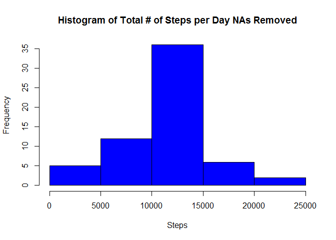
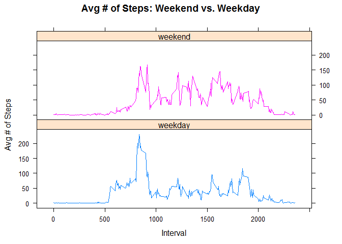

##Introduction

It is now possible to collect a large amount of data about personal movement using 
activity monitoring devices such as a Fitbit, Nike Fuelband, or Jawbone Up. These 
type of devices are part of the "quantified self" movement -- a group of enthusiasts 
who take measurements about themselves regularly to improve their health, to find 
patterns in their behavior, or because they are tech geeks. But these data remain 
under-utilized both because the raw data are hard to obtain and there is a lack of 
statistical methods and software for processing and interpreting the data.

This assignment makes use of data from a personal activity monitoring device. 
This device collects data at 5 minute intervals through out the day. The data 
consists of two months of data from an anonymous individual collected during 
the months of October and November, 2012 and include the number of steps taken 
in 5 minute intervals each day.


##Data

Dataset: Activity monitoring data (activity.csv)

The variables included in this dataset are:

- steps: Number of steps taking in a 5-minute interval (missing values are coded as NA)


- date: The date on which the measurement was taken in YYYY-MM-DD format


- interval: Identifier for the 5-minute interval in which measurement was taken


The dataset is stored in a comma-separated-value (CSV) file and there are a total of 17,568 observations in this dataset.


*Download, unzip and read the data.*  
  


```r
## Download files for project
if(!file.exists("./RRdatasets")){dir.create("./RRdatasets")}
fileUrl <- "https://d396qusza40orc.cloudfront.net/repdata%2Fdata%2Factivity.zip"
download.file(fileUrl,destfile="./RRdatasets/Dataset.zip")

## Unzip dataSet and make directory
unzip(zipfile="./RRdatasets/Dataset.zip",exdir="./RRdatasets")

## Read Data

activitydata <- read.table("./RRdatasets//activity.csv", header = TRUE,
                   sep = ",", na.strings = "?", colClasses = c('numeric', 'character',
                                                               'numeric'))

##Convert date variable to date type
activitydata$date <- as.Date(activitydata$date)
```

***

> *Below are the answers to the questions related to the above dataset for the Course Project 1 for Week 2 of the Reproducible Research class*  


#### **What is mean total number of steps taken per day?**
*For this section, ignore the missing values in the dataset.*  

  

```r
## Calculate the total number of steps taken per day
StepsPerDay <- aggregate(steps ~ date, activitydata, sum)
        
## Create histogram of total number of steps taken per day

hist(StepsPerDay$steps, main = "Histogram of Total # of Steps per Day", 
     col="blue", xlab="Steps")
```

<!-- -->

```r
## Calculate and report the mean and median of the total number of steps taken per day
meanTotalSteps <- mean(StepsPerDay$steps, na.rm=TRUE)
meanTotalSteps
```

```
## [1] 10766.19
```

```r
medianTotalSteps <- median(StepsPerDay$steps, na.rm = TRUE)
medianTotalSteps
```

```
## [1] 10765
```

***  

#### **What is the average daily activity pattern?**  

  


```r
## Make a time series plot (i.e. type = "l") of the 5-minute interval (x-axis) 
## and the average number of steps taken, averaged across all days (y-axis)  

StepsPer5minInterval <- aggregate(steps ~ interval, activitydata, mean) 

                  
                 
plot(StepsPer5minInterval$interval, StepsPer5minInterval$steps, type="l",
     xlab="5-minite Interval", ylab="Average # of Steps", 
     main="Avg # of Steps Taken by Interval", col="red")
```

<!-- -->

```r
## Which 5-minute interval, on average across all the days in the dataset, 
## contains the maximum number of steps?

maxnumstepsinverval <- StepsPer5minInterval$interval[which.max(StepsPer5minInterval$steps)] 
maxnumstepsinverval
```

```
## [1] 835
```

***  


#### **Imputing Missing Values**  
*Note that there are a number of days/intervals where there are missing values* 
*(coded as NA). The presence of missing days may introduce bias into some calculations or summaries of the data.*


```r
## Calculate and report the total number of missing values in the dataset (i.e. 
## the total number of rows with NAs)

MissingValues <- sum(is.na(activitydata))
MissingValues
```

```
## [1] 2304
```

```r
## Devise a strategy for filling in all of the missing values in the dataset. 
## the strategy does not need to be sophisticated. For example, you could use 
## the mean/median for that day, or the mean for that 5-minute interval, etc.

## Create a new dataset that is equal to the original dataset but with the 
## missing data filled in.

# To fill in the missing data, the average number of steps during the 5 minute
# interval over all days will be assigned. 

ImputeNAs <- activitydata
for (i in 1:nrow(ImputeNAs)) {
        if(is.na(ImputeNAs$steps[i])) {
           find <- which(ImputeNAs$interval[i] == StepsPer5minInterval$interval)
           ImputeNAs$steps[i] <- StepsPer5minInterval[find,]$steps

           
        }
}


## Make a histogram of the total number of steps taken each day and Calculate 
## and report the mean and median total number of steps taken per day. 


StepsPerDaynoNA <- aggregate(steps ~ date, ImputeNAs, sum) #calculate steps per day

hist(StepsPerDaynoNA$steps, main = "Histogram of Total # of Steps per Day NAs Removed", 
     col="blue", xlab="Steps")
```

<!-- -->

```r
meanTotalStepsnoNA <- mean(StepsPerDaynoNA$steps, na.rm=TRUE)
meanTotalStepsnoNA
```

```
## [1] 10766.19
```

```r
medianTotalStepsnoNA <- median(StepsPerDaynoNA$steps, na.rm = TRUE)
medianTotalStepsnoNA
```

```
## [1] 10766.19
```

```r
## Do these values differ from the estimates from the first part of the 
## assignment? What is the impact of imputing missing data on the estimates 
## of the total daily number of steps?
```

**The means did not change; however, once the missing values were imputed the 
median of that dataset was lower than the original dataset.**    

***

#### **Are there differences in activity patterns between weekdays and weekends?** 
*Use the dataset with the filled-in missing values for this part.*  


```r
## Create a new factor variable in the dataset with two levels - "weekday" and 
## "weekend" indicating whether a given date is a weekday or weekend day.

ImputeNAs$day <- weekdays(ImputeNAs$date)   #create day variable
ImputeNAs$typeofday <- "weekday"            #set all to weekday
ImputeNAs$typeofday[ImputeNAs$day %in% c("Saturday", "Sunday")] <- "weekend" #change the weekends


## Make a panel plot containing a time series plot (i.e. type = "l") of the 
## 5-minute interval (x-axis) and the average number of steps taken, averaged 
## across all weekday days or weekend days (y-axis). See the README file in the 
## GitHub repository to see an example of what this plot should look like using 
## simulated data.


#Create dataset with average steps taken per interval by type of day
DayType5minInterval <- aggregate(steps ~ interval + typeofday, ImputeNAs, mean) 

library(lattice)

xyplot(steps ~ interval | typeofday, data=DayType5minInterval, groups=typeofday, pch=19, type="l", 
       layout=c(1,2), xlab="Interval", ylab="Avg # of Steps", 
       main="Avg # of Steps: Weekend vs. Weekday")
```

<!-- -->

**Yes, there are differences in activity patterns between weekdays and weekends.
There appears to be more morning activity on the weekdays and a higher average number of steps
by intervals throughout the day on weekends. **

